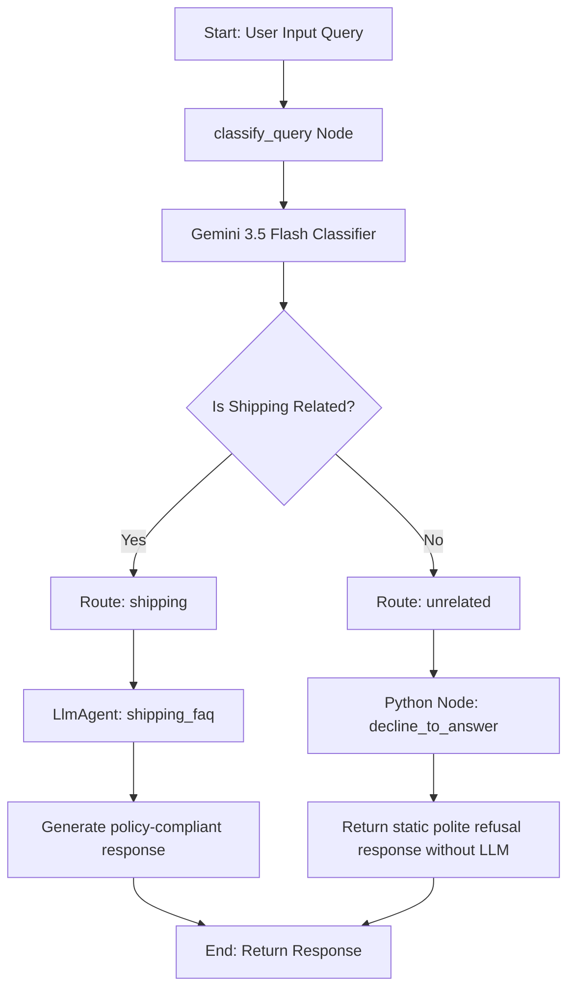

# AI Customer Support Agent

An intelligent customer support routing agent built with the Google Agent Development Kit (ADK 2.0) and Python. It utilizes an event-driven graph workflow to classify incoming queries, route shipping-related questions to a specialized LLM FAQ agent, and decline unrelated queries directly in Python to save LLM tokens.

## Project Structure

```
customer-support-agent/
├── app/                  # Core agent code
│   ├── agent.py          # Main agent and graph workflow definition
│   └── app_utils/        # App utilities and helpers
├── tests/                # Unit, integration, and load tests
│   ├── eval/             # LLM-as-judge quality evaluations
│   ├── integration/      # Integration test suite
│   └── unit/             # Unit test suite
├── pyproject.toml        # Project dependencies (FastAPI, ADK, etc.)
└── Dockerfile            # Container deployment configuration
```

---

## Architecture & Flow

The agent utilizes a directed graph workflow to coordinate query classification and response generation. Unrelated queries bypass LLM processing entirely, conserving token usage.



---

## Setup & Running

### Requirements

Before you begin, ensure you have:
- **uv**: Python package manager
- **agents-cli**: Google Agents CLI
- **Google Cloud SDK**: For GCP authentication

### Installation

1. Install `agents-cli` and dependencies:
   ```bash
   uvx google-agents-cli setup
   agents-cli install
   ```

2. Run the agent locally:
   ```bash
   agents-cli playground
   ```

## Running Tests & Evals

- Run unit and integration tests:
  ```bash
  uv run pytest tests/unit tests/integration
  ```
- Run quality evaluations:
  ```bash
  agents-cli eval generate
  agents-cli eval grade
  ```
